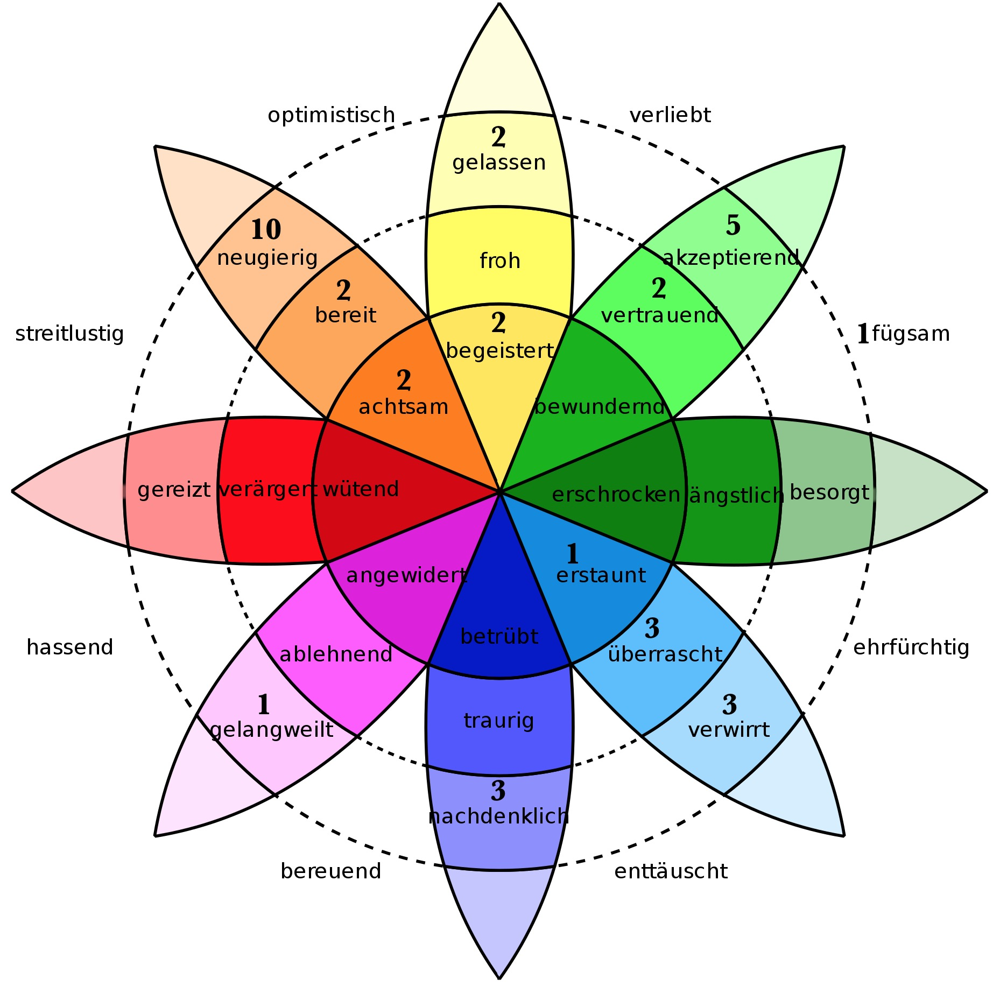

# Evaluierung

## Beschreibung der Befragung

Der gesamte Fragebogen ist im digitalen Anhang unter *evaluationsbogen.pdf* zu finden.

### Skalen

Beim Entwickeln eines Fragebogens für die Evaluierung eines Kunstwerkes ist es schwierig verbalisierte Skalen vorzugeben, da es sich teilweise um Frageinhalte handelt welche Wahrnehmungskomplexe in einfache Quantisierungen einteilen sollen. Verbalisiert man die Skala, also gibt eine Beschreibung zu jedem der Wertungsmöglichkeiten, ist man durch Limitierungen von sprachlichen Formulierungen eingeschränkt. 

Eine endpunktbenannte Skala benennt nur die beiden extremen Skalenpunkte und die Skalenpunkte dazwischen werden mit aufsteigenden Zahlen versehen. Sie haben zusätzlich zu der Umgehung sprachlicher Limitierungen noch den Vorteil, dass sie als intervallskaliert angenommen werden können, da der Abstand der einzelnen Skalenpunkte zwischen den beiden Extremen von Befragten als gleichwertig verstanden wird. [@porst_arten_2011 S. 80]

Bei der Entscheidung ob eine gerade oder ungerade Skala genutzt werden soll, fiel die Wahl auf eine ungerade Skala, da insbesondere bei zweidimensionalen Skalen eine Mittelposition eine legitime Antwortmöglichkeit und eine bewusste Entscheidung sein kann.  [@porst_arten_2011 S. 82] Dass der mittlere Skalenpunkt als Fluchtkategorie verwendet werden könnte wurde abgewogen, die Daten der gegebenen Antworten über alle Fragen deuten jedoch eine Normalverteilung an, weshalb vermutet werden kann, dass die mittlere Kategorie nicht als Fluchtkategorie wahrgenommen wurde. (vgl. Abbildung \ref{skalierung})

\begin{figure}[h]
\centering
\includegraphics[width=11cm]{skalierung}
\break
\caption{Befragungswerte in schwarz \colorbox{black}{  } ganzrationale Trendlinie in grau \colorbox{lightgray}{  }. \label{skalierung}}
\end{figure}

Bei der Auswahl der Dimensionalität der Skala wurde für Fragen über die Wahrnehmung eine zweidimensionale und für Fragen der Selbsteinschätzung eine eindimensionale Skala verwendet.

Eine eindimensionale Skala ist eine Skala, welche nur Antworten in eine Richtung zulässt (z.B. keine Zustimmung bis totale Zustimmung). Eine zweidimensionale Skala hingegen verläuft von einem negativen Wert über einen Mittelpunkt hin zu einem positiven Wert. (z.B. von totaler Ablehnung zu totaler Zustimmung). [@porst_arten_2011 S. 89]

Eine Ausnahme hierbei stellt die Frage über das Anstoßen von originellen Gedankengängen. Die Dimensionalität ist augenscheinlich eindimensional, da der minimale Extremwert mit *"Keine neuen Gedanken"* beschrieben wird. Der Maximalwert jedoch wird als *"etwas vorher noch nicht erfasstes"* beschrieben. Das Maximum bezieht sich hier also speziell auf die Originalität des Gedankens, womit als Mittelpunkt der Skala eine Wirkung definiert sein könnte die zwar Gedankengänge anstößt, diese jedoch nicht als besonders originell empfunden werden.

Die ungenaue Dimensionalität dieser Frage besteht, da es kein sprachlich Darstellbares Gegenteil des Anstoßens eines originellen Gedankens gibt. Diese Ungenauigkeit ist jedoch nicht besonders relevant, da die Zweidimensionalität bei Fragen über die Wahrnehmung nur gewählt wurde, um einen höheren Informationsertrag durch erhöhten Spielraum in den Antwortmöglichkeiten zu erreichen.

### Rad der Emotionen

![Rad der Emotionen nach Robert Plutchik [@metoaster_robert_2012]\label{radderemotionen}](Graphics/emotionenleer.jpg){ height=400px }

Robert Plutchik suchte nach einer allgemein gültigen Einteilung und Kategorisierung von Emotionen. Er nutzte hierfür Prinzipien aus der psychologischen Beobachtungen von nicht menschlichen Tieren. Er beschreibt hierfür Emotionen im Sinne ihrer Funktion in einem Verlauf von Stimulus und Handlung. Zunächst gibt es einen Stimulus, aus welchem eine Kognition resultiert. Ein Gefühlszustand wird dadurch ausgelöst und eine Aktion wird durchgeführt um den gewünschten Effekt zu erzielen. Der ausgelöste Gefühlszustand wird vom Individuum als Emotion wahrgenommen.

Eine Bedrohung kann beispielsweise ein Stimulus sein, daraus erfolgt dann die Kognition von Gefahr. Der dadurch verursachte Gefühlszustand ist Angst, diese bewegt das Individuum zur Flucht, welche den gewünschten Effekt der Sicherheit erzeugt.

Basierend auf Darwins Forschung zu Emotionen kommt Plutchik zu dem Schluß, dass Emotionen die evolutionäre Fitness steigern können. Er definierte acht Grundemotionen welche auf diese Weise begründet werden können und verteilte sie im Rad der Emotionen von innen nach außen schwächer werdend und nach Farben in acht Strahlen, welche die Grundemotionen darstellen, eingeteilt.

Die in den Leerstellen von Abb. \ref{radderemotionen} zu sehenden Emotionen sind die sogenannten *primary dyads* also Kombinationen aus zwei Grundemotionen. Plutchik erklärt die Vielfalt der erlebten Emotionen unter anderem dadurch, dass viele dieser Kombinationen aus Grundemotionen oder Kombinationen aus Kombinationen sind (*secondary dyads*, *tertiary dyads*, etc.). [@plutchik_nature_2001 S. 345ff]

Dieses Rad wurde zur Abfrage der in der Installation erlebten Emotionen genutzt, da die Nutzung dessen das Interesse und die Motivation der Nutzer signifikant erhöht. Dies ist wichtig, da die Motivation des Nutzers beim ausfüllen von Fragebögen wichtig für die Qualität der Antworten ist. [@warpechowski_tagging_2019]

### Zusätzliche Fragen

Zu den fragen, welche durch die Benutzung von Skalen beantwortet werden konnten, wurde noch eine offene Frage mit einem Textfeld für die Antwort gestellt. Hier wurde nach den durch das Kunstwerk angestoßenen Gedanken gefragt. 

Für die bessere Einordnung der Antworten wurden Fragen über Tätigkeit, Alter und vorangehende Erfahrungen mit Interaktiven Kunstwerken gestellt.

### Limitierungen

Zunächst ist die Evaluation dadurch limitiert, dass die Befragten zu einem großen Teil persönliche bekannte des Künstlers waren. Es ist anzunehmen, dass dies dafür sorgte, dass die Daten in die Richtung verzerrt sind, die die Teilnehmer als im Sinne des Künstler empfanden.

Eine kleine Stichprobengröße von 15 sorgt außerdem dafür, dass Ausreißer in den Daten, nicht die Chance haben ausgeglichen zu werden und schlagen sich stark in berechneten Durchschnittswerten wider, wodurch diese weniger brauchbar werden.

Weiterhin war die Umgebung der Evaluation wenig kontrolliert, da sie auf einer öffentlichen Veranstaltung stattfand, die einer Vernissage ähnelte. Dies war zwar gewünscht, da dies eine angemessene Umgebung für das Wahrnehmen einer solchen Installation ist, jedoch bedeutet dies auch, dass unkontrollierbare Faktoren in die Bewertung mit einflossen.

Das Ausschenken von Alkohol im Rahmen der Veranstaltung ist ein potentieller Faktor, welcher die Wahrnehmung der Teilnehmer getrübt haben könnte. Aus diesem Grund wurden die Teilnehmer darum gebeten, die Fragebögen möglichst bald nach ihrer Ankunft auszufüllen, es wurde jedoch nicht kontrolliert, ob dieser Bitte gefolgt wurde.

Weiterhin gab es im Laufe der Veranstaltung eine Zeitspanne, in der die Installation auf Grund eines Softwarefehlers nicht immer auf das Berühren von Zügen reagierte.

## Gewonnene Erkenntnisse {#gewonnene-erkenntnisse}

Die Umhüllung wurde sehr unterschiedlich empfunden, mit einem leichten Trend zu weg von als räumlich wahrgenommenen Klang hin zu nicht umhüllenden Klang. Daraus könnte geschlossen werden, dass die Eingebauten Soundprocessings von Hall, Positionierung und Lautstärke durch Distanz, nicht ausreichen oder nicht korrekt konfiguriert wurden um einen räumlichen Klangeindruck zu schaffen.

Bei der Einbindung der Klänge der Installation in den Ausstellungsraum ist ein leichter Trend hin zur Wahrnehmung des Klangs als seperat vom Ausstellungsraum festzustellen, was die These, dass die räumlichen Effekte verbesserungswürdig sind bestärkt.

Die Installation wurde von 73% der Befragten als neutral oder schöner bezeichnet. Dies war überraschend, da in der Installation Klänge genutzt wurden, welche stark von konventionellen Hörgewohnheiten abweichen. Jedoch war dies ein willkommenes Ergebnis, denn die Installation soll nicht als hässlich empfunden werden, da sie sowohl positive als auch negative Emotionen darstellen soll.

Das Erlebte wurde außerdem überwiegend als Angenehm bewertet, was einen Hinweis darauf gibt, dass die Herstellung der Klangobjekte das Publikum nicht verstörte und dadurch potentiell die Möglichkeit hat auf den Besucher zu wirken.

Die Frage danach ob Inhalt oder Umsetzung im Vordergrund standen ergab die meisten Extremantworten. Ein möglicher Erklärungsansatz liegt darin, dass die Steckbriefe der Personae nicht einfach zu finden waren, denn die Befragten welche angaben, dass in ihrer Wahrnehmung die Umsetzung im Vordergrund stand, gaben in der emotionalen Zustandsabfrage auch an Gefühle von Verwirrung, Überraschung oder Erstaunen verspürt zu haben.

Ein Großteil der Befragten gab an, die Installation löse keine originellen Gedanken aus, nur ein Viertel gab an diese Gedanken würden sie am nächsten Tag noch beschäftigen. Dies könnte entweder durch eine Mangelhafte inhaltliche Idee der Installation oder durch eine mangelhafte Kommunikation des Inhalts der Installation zu erklären sein.

{ height=400px }

Anhand der angegebenen Emotionen aus dem Rad der Emotionen (siehe Abb. \ref{radderemotionendaten}) ist zu erkennen, dass Überwiegend positive Emotionen empfunden wurden. Dies widerspricht nicht dem gewünschten Effekt, da die Installation unter anderem darauf abzielte die veränderte Geräuschkulisse durch die Maschinen im nachindustriellen Zeitalter als etwas ästhetisches darzustellen. 

Eine Ausnahme bildet die häufige Angabe von Verwirrung, Überraschung und Erstaunen. Diese könnte viele Gründe haben, eine Vermutung jedoch wäre, dass einige dieser Antworten, aus dem Zeitraum stammen, in dem die Installation nicht korrekt funktioniert hat. Eine andere Möglichkeit ist, dass der Nutzer nicht genug Orientierungshilfe erhielt um sich von der Installation willkommen geheißen zu fühlen.